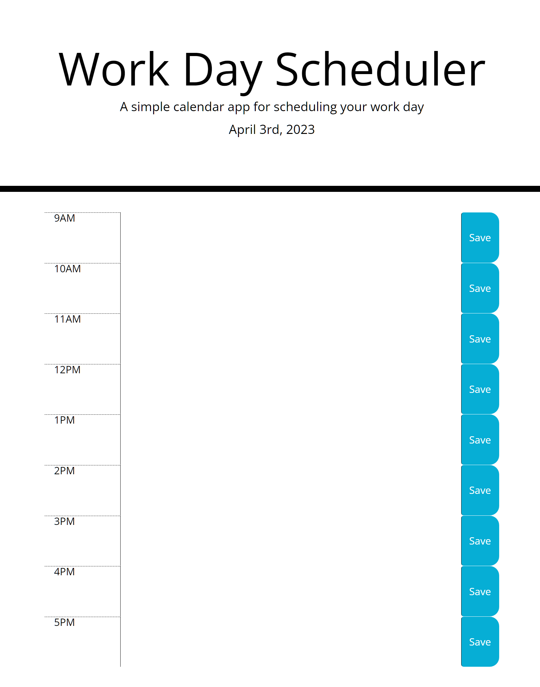
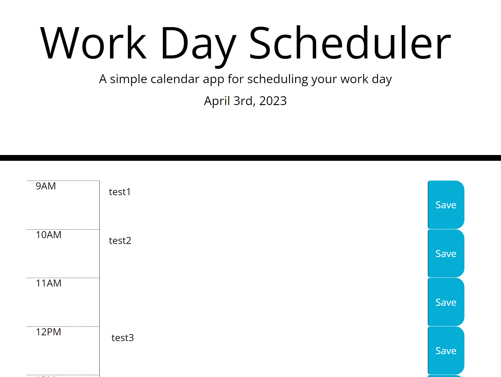

# JC--Planner-App

## Description

The motivation for this project was to create a simple calendar application that allows a user to save events for each hour of the day.

This app runs in the browser, and features updated HTML and CSS powered by jQuery.

 

## Installation

No installation required. 

Application can be accessed through the following URL:
 
https://jeanj22.github.io/JC--Planner-App/ 

 

## Usage

The following steps show how the user can navigate the calendar application:

1. First the user opens the app through the url: https://jeanj22.github.io/JC--Planner-App/ 

2. Once open, the top of the page they will display the current month/day/year 

3. The main body of the page will show 'timeblocks' representing standard business hours running from 9am to 5pm when the user scrolls down the page
 
4. The user can enter/type in an event when they click the center section of the timeblock

5. The users event can then be saved into local storage, when they click the save button to the right of their entry

 

Accessing stored entry/data from local storage:
1. Within the browser window 'right-click' on the mouse/trackpad
3. Then select 'Inspect' from the menu 
4. Then 'Application' within the inspector box
5. Then within Storage/ Local Storage / File
6. The Key (timeblock) and Value (saved entry/data) will then be displayed

 

## Screenshots 

JC--Planner-App:

Example of how to store data:

Shows data saved in local storage:

## Credits
Resources used:
- https://api.jquery.com/parent/
- https://api.jquery.com/siblings/
- https://api.jquery.com/data/#data1

 

## License
N/A

